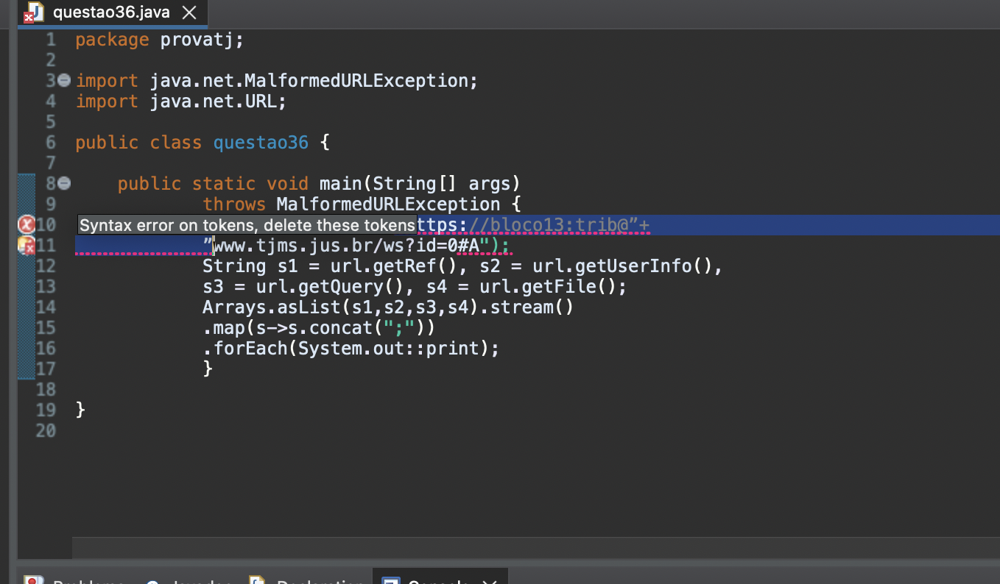
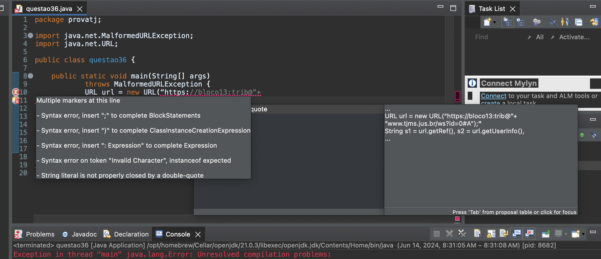
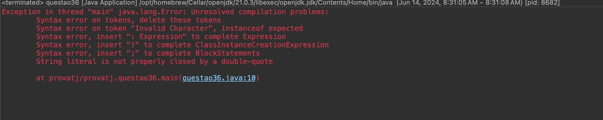

# Questão


## Código da Questão
```java
public static void main(String[] args)
throws MalformedURLException {
URL url = new URL(“https://bloco13:trib@”+
”www.tjms.jus.br/ws?id=0#A");
String s1 = url.getRef(), s2 = url.getUserInfo(),
s3 = url.getQuery(), s4 = url.getFile();
Arrays.asList(s1,s2,s3,s4).stream()
.map(s->s.concat(";"))
.forEach(System.out::print);
}
```
> Código copiado na integra da prova https://conhecimento.fgv.br/sites/default/files/concursos/tecnico-de-nivel-superior-analista-de-sistemas-computacionais-web-designercr-09-wd-tipo-1.pdf
> PDF da prova anexado ao repositório dia 2/8/2024

## Resultado ao executar o código





